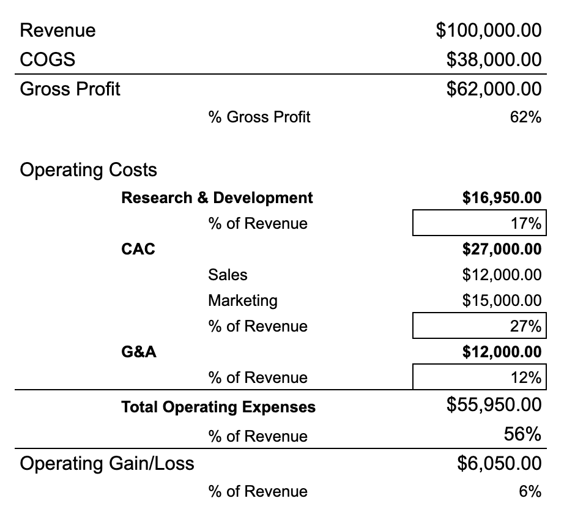

# SaaS Standard Financials

Which brings us to another principle of SaaS sales success: **Costs are accounted for before the deal begins**. 

If you're worried about costs, you won't be thinking about lifetime value, you'll be thinking about GP. Costs and GP are baked into SaaS models. Here's a simplified look at the financials of a successful SaaS product:

Because successful SaaS companies bake in their commitment to R&D, Sales and Marketing, and Operations, the net profit of the product is fairly static. Costs are controlled at an organizational level, not an account level. 

At the account level, SaaS companies sell SLA packages keeping the percentages static. 

Regardless of the realities of our accounting and investments, let's assume that Maritz will adopt the standard SaaS accounting formula, perhaps adjusting allocations between R&D, CAC, etc. 

Because of this, sellers are free from worrying about costs and concentrate on the most important aspect of SaaS selling: booking clients who have a high probability of high LTV. 