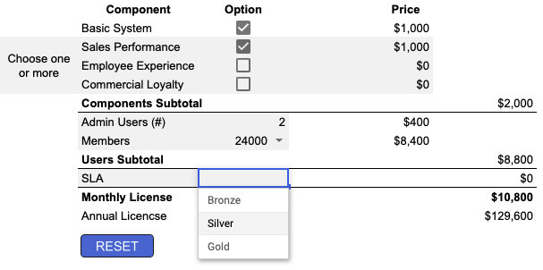

# SaaS Pricing Made Easy

The list price a customer expects to pay for our products should be predictable. There are four basic elements to price in a SaaS product like BIE:

* Basic license fee
* Add-ons
* Number of users
	* Administrative
	* Program members
* SLA package

When we keep pricing simple, we can create a reliable pricing calculator that does the math for us. Here is [a prototype of such a calculator](https://docs.google.com/spreadsheets/d/1Z-NK5SjKjzK-Z0cjlAxUEKvRQuVXfA1WTwwiK1jrP3k/edit?usp=sharing). 

*NOTE: This is just a prototype, not an official pricing tool. I just made up the prices displayed here. The prototype is not intended replace our official pricing process, but give a demonstrate of how simple SaaS pricing could be.**

In this prototype, the basic system is required. Then:

* Check one or more feature sets (Employee, Sales, Commercial)
* Enter the number of admin users (0 to 100)
* Select the expected membership volume 
* Select an SLA package
* See the monthly price (MRR) and annual price (ARR)

You can also print the sheet or save as PDF. 

The RESET button just returns all the values to their defaults.

## Discounts

Price calculators provide a convenient way to figure the list price for a SaaS product. They don't prevent an AE from charging more or less than list price, but be careful about charging *more* than list price. 

Common discounts include:

* Discounts for add-on features
* Discounts for contracts of 2, 3, or more years
* Discounts for additional admin or member users

The important thing to remember is that list pricing isn't intended to box you in; it's intended to make pricing easy. 

## Discussion Questions

1. Would a pricing calculator like this prototype make the selling process easier for you? 
2. Would show the results of the calculator to a client?
3. Should the platform price calculator be part of a larger deal calculator with similar features for awards, professional services, creative, etc?

